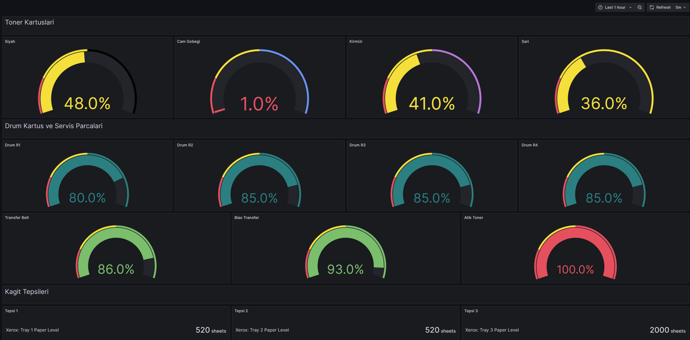

<div align="center">

# 🖨️ Xerox AltaLink SNMP Monitoring

**Zabbix Template & Grafana Dashboard**

Xerox AltaLink serisi yazıcılar için kapsamlı SNMP izleme çözümü.  
Toner seviyeleri, drum kartuşları, kağıt tepsileri, baskı sayaçları ve sistem durumu — hepsi tek ekranda.

<br>

[](https://www.zabbix.com/)
[](https://grafana.com/)
[](https://en.wikipedia.org/wiki/Simple_Network_Management_Protocol)
[](LICENSE)

<br>

> ✅ **Test edildi:** Xerox AltaLink C8255  
> 🔄 **Uyumlu:** AltaLink C8130 · C8135 · C8145 · C8155 · C8170

</div>

---

## 📸 Dashboard Görünümü




---

## 📦 Dosyalar

| Dosya | Açıklama | İçerik |
|-------|----------|--------|
| 📄 `xerox_altalink_template.yaml` | Zabbix SNMP template | 31 SNMP item + 11 calculated item |
| 📊 `xerox_grafana_dashboard.json` | Grafana dashboard | 5 bölüm, 20+ panel |
| 📖 `README.md` | Bu dosya | Kurulum ve teknik detaylar |

---

## 📡 İzlenen Veriler

<details>
<summary><b>🖨️ Toner Kartuşları (4 item)</b></summary>

| Item | OID | Birim |
|------|-----|-------|
| Toner: Siyah % | `1.3.6.1.2.1.43.11.1.1.8/9.1.1` | % |
| Toner: Cam Göbeği % | `1.3.6.1.2.1.43.11.1.1.8/9.1.2` | % |
| Toner: Kırmızı % | `1.3.6.1.2.1.43.11.1.1.8/9.1.3` | % |
| Toner: Sarı % | `1.3.6.1.2.1.43.11.1.1.8/9.1.4` | % |

</details>

<details>
<summary><b>🔵 Drum Kartuşları & Servis Parçaları (7 item)</b></summary>

| Item | OID | Birim |
|------|-----|-------|
| Drum Kartuş R1 % | `1.3.6.1.2.1.43.11.1.1.8/9.1.5` | % |
| Drum Kartuş R2 % | `1.3.6.1.2.1.43.11.1.1.8/9.1.6` | % |
| Drum Kartuş R3 % | `1.3.6.1.2.1.43.11.1.1.8/9.1.7` | % |
| Drum Kartuş R4 % | `1.3.6.1.2.1.43.11.1.1.8/9.1.8` | % |
| Atık Toner % | `1.3.6.1.2.1.43.11.1.1.8/9.1.9` | % |
| Transfer Belt % | `1.3.6.1.2.1.43.11.1.1.8/9.1.10` | % |
| Bias Transfer Roll % | `1.3.6.1.2.1.43.11.1.1.8/9.1.11` | % |

</details>

<details>
<summary><b>📄 Kağıt Tepsileri (3 item)</b></summary>

| Item | OID | Birim |
|------|-----|-------|
| Kağıt Tepsisi 1 | `1.3.6.1.2.1.43.8.2.1.9.1.1` | yaprak |
| Kağıt Tepsisi 2 | `1.3.6.1.2.1.43.8.2.1.9.1.2` | yaprak |
| Kağıt Tepsisi 3 | `1.3.6.1.2.1.43.8.2.1.9.1.3` | yaprak |

</details>

<details>
<summary><b>📊 Baskı Sayaçları (5 item)</b></summary>

| Item | OID | Birim |
|------|-----|-------|
| Baskı: Toplam | `1.3.6.1.4.1.253.8.53.13.2.1.6.1.20.1` | sayfa |
| Baskı: Siyah | `1.3.6.1.4.1.253.8.53.13.2.1.6.1.20.34` | sayfa |
| Baskı: Renkli | `1.3.6.1.4.1.253.8.53.13.2.1.6.1.20.33` | sayfa |
| Baskı: Siyah Sayfa | `1.3.6.1.4.1.253.8.53.13.2.1.6.1.20.8` | sayfa |
| Baskı: Renkli Sayfa | `1.3.6.1.4.1.253.8.53.13.2.1.6.1.20.30` | sayfa |

</details>

<details>
<summary><b>⚙️ Sistem (4 item)</b></summary>

| Item | Açıklama |
|------|----------|
| Yazıcı Durumu | Hazır / Isınıyor / Basıyor / Hata |
| ICMP Ping | Online / Offline |
| Gecikme | ICMP yanıt süresi (ms) |
| Çalışma Süresi | Kesintisiz açık kalma süresi |

</details>

---

## 🎨 Renk Kodları

Grafana gauge panellerinde eşik renkleri:

```
  0%        20%        50%       100%
  ├──────────┼──────────┼──────────┤
  🔴 KRİTİK  🟡 DÜŞÜK   🟢 NORMAL
```

| Renk | Aralık | Yapılacak İşlem |
|------|--------|-----------------|
| 🔴 Kırmızı | %0 — %20 | Acil sipariş ver |
| 🟡 Sarı | %20 — %50 | Yakında sipariş verilmeli |
| 🟢 Yeşil | %50 — %100 | Normal, işlem gerekmez |

---

## 🚀 Kurulum

### Ön Koşul — Yazıcıda SNMP Aktif Etme

Yazıcının web arayüzüne giriş yap:

```
http://<YAZICI_IP>
```

Şu yolu izle:

```
Properties → Connectivity → Protocols → SNMP
```

| Ayar | Değer |
|------|-------|
| SNMP v1/v2c | ✅ Aktif |
| Community Name | `public` |

SNMP bağlantısını doğrulamak için:

```bash
snmpwalk -v2c -c public <YAZICI_IP> 1.3.6.1.2.1.43.11.1.1.6.1
```

Çıktıda toner isimleri görünüyorsa bağlantı başarılı demektir:
```
iso.3.6.1.2.1.43.11.1.1.6.1.1 = STRING: "Black Toner"
iso.3.6.1.2.1.43.11.1.1.6.1.2 = STRING: "Cyan Toner"
...
```

---

### Adım 1 — Zabbix Template Import

```
Configuration → Templates → Import
```

1. `xerox_altalink_template.yaml` dosyasını yükle
2. **Templates** ve **Items** seçeneklerini işaretle
3. **Import** butonuna bas

✅ Template listesinde **Xerox AltaLink by SNMP** görünecek.

---

### Adım 2 — Host Ekleme

```
Configuration → Hosts → Create Host
```

**Host Bilgileri:**

| Alan | Değer |
|------|-------|
| Host name | `Xerox-AltaLink-C8255` |
| Visible name | `Xerox AltaLink C8255 (192.168.x.x)` |
| Groups | `Printers` |

**SNMP Interface:**

| Alan | Değer |
|------|-------|
| Type | `SNMP` |
| IP Address | Yazıcının IP adresi |
| Port | `161` |
| SNMP Version | `SNMPv2` |
| Community | `public` |

**Templates:**
- ✅ `Xerox AltaLink by SNMP`
- ✅ `Generic by SNMP` *(ping ve uptime için)*

---

### Adım 3 — Grafana Dashboard Import

```
Dashboards → Import → Upload JSON file
```

1. `xerox_grafana_dashboard.json` dosyasını yükle
2. **Datasource** olarak Zabbix datasource'unu seç
3. **Import** butonuna bas

> ⏳ İlk veri toplanana kadar yaklaşık **5 dakika** bekle.

---

## 🔧 Teknik Notlar

### Toner Yüzdesi Hesaplama

Xerox AltaLink, standart **Printer MIB (RFC 1759)** değerlerini ters kullanır:

| MIB Alanı | Standart Anlam | Xerox'un Kullanımı |
|-----------|---------------|-------------------|
| `prtMarkerSuppliesCurrentLevel` | Mevcut miktar | Toplam kapasite (sabit) |
| `prtMarkerSuppliesMaxCapacity` | Maksimum kapasite | **Kalan miktar** |

Bu nedenle hesaplama şu şekilde yapılır:

```
Yüzde (%) = Max Kapasite / Seviye × 100
```

### Cyan Toner Hassasiyeti

Cyan kartuşu **Reorder** moduna girdiğinde SNMP değerleri farklı ölçek kullanabilir. Bu durumda ±5-10 puan hata payı oluşabilir. Asıl önemli olan yazıcının **Reorder** uyarısı verip vermediğidir.

### Güncelleme Aralığı

| Bileşen | Aralık |
|---------|--------|
| Zabbix item toplama | 5 dakika |
| Grafana dashboard yenileme | 5 dakika |

---

## 📋 Gereksinimler

| Bileşen | Minimum Sürüm |
|---------|---------------|
| [Zabbix](https://www.zabbix.com/) | 7.0 |
| [Grafana](https://grafana.com/) | 11.0 |
| [Zabbix Plugin for Grafana](https://grafana.com/grafana/plugins/alexanderzobnin-zabbix-app/) | 4.x |
| Yazıcı SNMP | v2c aktif, community: `public` |

---

## 📄 Lisans

[MIT License](LICENSE) — Serbestçe kullanabilir, değiştirebilir ve paylaşabilirsin.

---

## 🤝 Katkı

Pull request ve issue'lar memnuniyetle karşılanır.  
Farklı Xerox modelleri için test sonuçlarını paylaşırsan çok yardımcı olur.

---

<div align="center">

Hazırlandı ile ❤️

</div>
